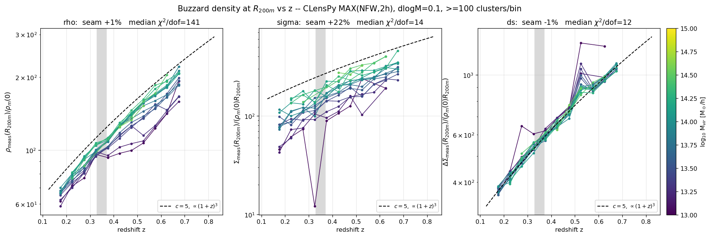
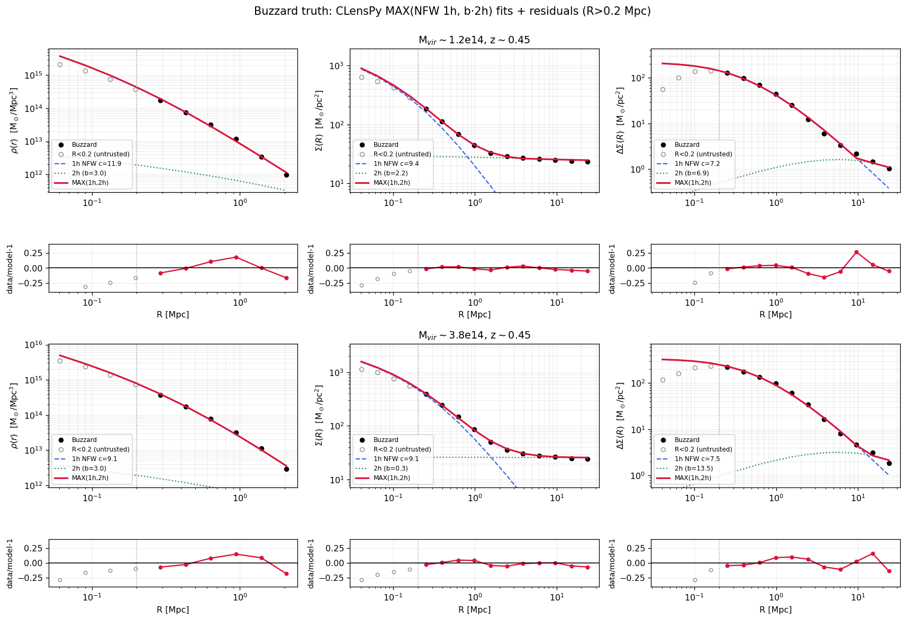
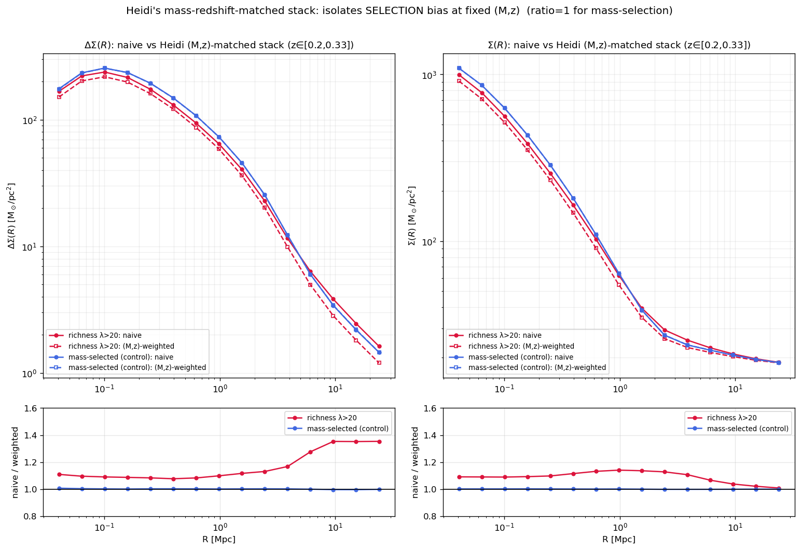
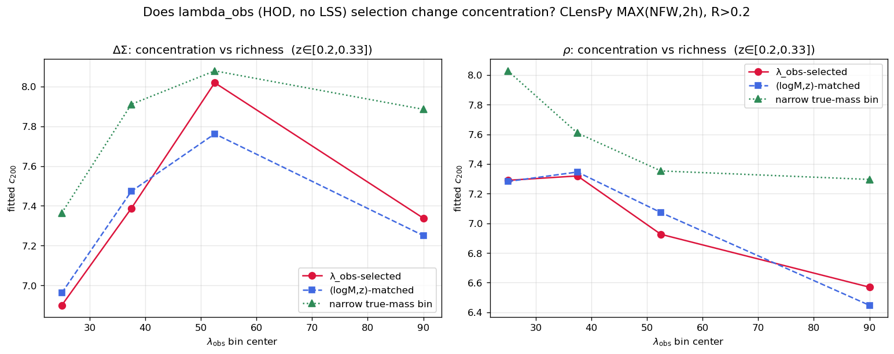
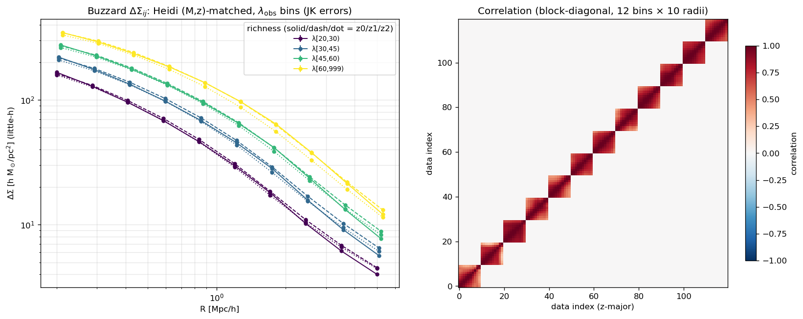
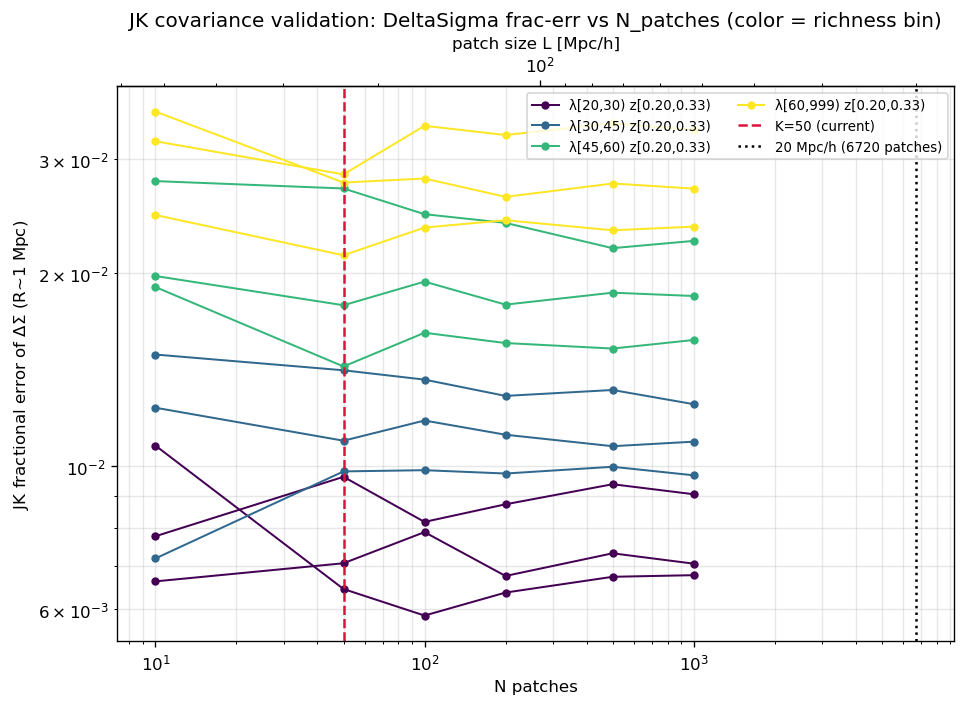

# Buzzard cluster profiles: physical (1+z)³ density vs the comoving pipeline

**Validation report — DES-Y3 cluster weak-lensing pipeline vs Buzzard v1.9.8**
Cosmology: FlatΛCDM, H₀=70, Ω_m=0.286 (DeRose+2019). Quality cuts: `pid==-1`,
`0≤cosi≤1`, box-seam excised (0.33≤z≤0.37 dropped), Mvir≥10¹³ M⊙.
Radii/densities are **physical** unless stated (see the [units ledger](#units-ledger)).

---

## TL;DR

1. **Buzzard truth halos follow the physical (1+z)³ mean-density scaling.** Fitting
   NFW profiles to the truth ρ(r), Σ(R) *and* ΔΣ(R) and reading the density at R₂₀₀ₘ
   gives, mass-collapsed, ρ(R₂₀₀ₘ)/ρ_m(z=0) ∝ (1+z)³ in all three probes.
2. **The pipeline builds the 1-halo term with comoving ρ_m0 frozen at z=0**, i.e.
   (1+z)⁰ — so it structurally omits this growth. The same mismatch appears in the
   concentration: the frozen-z=0 M₂₀₀ₘ inflates c by (1+z)^~1.3 vs the physical one.
3. **We have NOT yet fixed the exact (1+z) power** to put in the pipeline — that is
   the next step. What we now have is a robust, CLensPy-based fitting recipe and a
   validated stacking method to build the λ_obs-binned ΔΣ data vector.
4. **Richness (λ_obs, HOD, no LSS) selection does *not* bias the concentration**; it
   only lowers c by ~5–10% through mass-mixing. (Real redMaPPer LAMBDA_CHISQ *would*
   bias it via orientation/LSS — a separate optical-selection systematic.)

---

## 1. Buzzard halos track the physical (1+z)³ density at R₂₀₀ₘ

For each (Mvir, z) bin (Δlog₁₀M=0.1, Δz=0.05, ≥100 clusters/bin) we fit
`MAX(NFW 1-halo, b_cls·2-halo)` (CLensPy, R>0.2 Mpc), solve R₂₀₀ₘ from spherical
overdensity on the fitted (ρ_s, r_s) using the **physical** mean density
`mean(<R₂₀₀ₘ) = 200·ρ_m(z) = 200·ρ_m0·(1+z)³`, then read the *directly measured*
profile at R₂₀₀ₘ.



- **ρ(r)** and **ΔΣ(R)** both cleanly track the `c=5, (1+z)³` reference (dashed),
  mass-collapsed. **Σ(R)** is noisier (the uniform mean-density sheet is a large,
  fragile subtraction at R₂₀₀ₘ) but consistent.
- The **box-seam step is ≲1%** in ρ and ΔΣ — with the robust fit there is no
  significant density discontinuity across the z≈0.33 box junction. Σ's residual
  +22% is background-subtraction noise (the fragile sheet at R₂₀₀ₘ), not a physical
  seam.

All three probes are fit with the **same CLensPy `NfwProfile` + `TwoHaloTerm`**
recipe (§3), so the agreement across ρ/Σ/ΔΣ is physical, not a code artefact.

**Conclusion:** the halo density at the overdensity boundary follows the physical
mean matter density, (1+z)³.

---

## 2. The pipeline is comoving — the (1+z) it misses shows up in the concentration

The pipeline's 1-halo term uses **comoving ρ_m0 frozen at z=0**. The same
convention appears in a single fit two ways — *same halo, one fit* (physical
ρ_s=9.8×10¹⁴ M⊙/Mpc³, r_s=0.239 Mpc, at z≈0.45):

| M₂₀₀ₘ definition | reference density | c₂₀₀ₘ |
|---|---|---|
| **physical** (standard, Child18/colossus) | 200·ρ_m(z)=200·ρ_m0(1+z)³ | **4.9** |
| **frozen-z=0** (CLensPy `NfwProfile` **and the pipeline**) | 200·ρ_m0 | **7.9** |

```
c_frozen / c_physical = 1.61 = (1+z)^1.3   at z=0.45
```

There is **one** concentration, quoted in two conventions differing by the (1+z)
factor. The physical value (c≈5 ≈ Child18×1.25, the Buzzard over-concentration) is
the literature-comparable one; CLensPy/pipeline report the frozen-z=0 value (c≈7).
**All the R₂₀₀ₘ plots above use the physical convention.** Figures whose captions
show CLensPy's raw c (§3, §5) are in the frozen-z=0 convention (÷(1+z)^~1.3 to
compare with Child18).

> **This is exactly the open question.** We have *demonstrated* the halos carry
> (1+z)³ and the pipeline is comoving; we have **not** yet derived the effective
> (1+z) power for the *projected* observable (ΔΣ), which the line-of-sight integral
> dilutes from (1+z)³ toward ~(1+z)^0.7–1. Deriving/validating that power is the
> next step.

---

## 3. Robust fitting recipe (CLensPy, R>0.2, MAX(NFW,2h))

The measured profiles are **not** a single self-consistent NFW if fit naively: the
concentration falls ρ→Σ→ΔΣ because (a) small scales (R<0.2 Mpc) are unreliable
(resolution/miscentering: ΔΣ *turns over* at R~0.15 Mpc, which a pure NFW never
does) and (b) the 2-halo term flattens the projected profiles.

The fix (recipe from J. Esteves): **trust only R>0.2 Mpc**, and fit
`MAX(NFW_1h(M200,c200), b_cls·2halo(R,z))`, where the 2-halo template depends only
on (R,z) (CLensPy `TwoHaloTerm` from a CAMB P(k,z)) and the single extra parameter
is the bias amplitude b_cls. Σ additionally carries the measured uniform sheet.



With this recipe the **masses agree across ρ/Σ/ΔΣ** and the ΔΣ concentration
recovers from the artifact c≈3.4 to c≈7–8 (frozen-z0), consistent with ρ/Σ.
Residuals are flat within ±5% (Σ), ±15% (ΔΣ), for R>0.2.

---

## 4. Heidi's mass-redshift-matched stacking (selection bias)

Heidi's `stacked_profile_weighted_by_mass_redshift` (muStarSigmaProfiles) is **not**
a plain average. It builds a (log₁₀M, z)-**matched reference**: for each fine
(Δlog₁₀M=0.1, Δz=0.05) cell it takes the mean profile of **all** halos, weighted by
how many *selected* clusters land there:

```
stack(R) = Σ_cells [ N_select(cell) · ⟨profile_ALL(cell)⟩(R) ] / Σ_cells N_select(cell)
```

The ratio `naive / weighted` is the **selection bias at fixed (M,z)**.



- **Mass-selected control:** naive = weighted, ratio ≡ 1 (the method has no bias for
  a clean mass cut).
- **redMaPPer richness (LAMBDA_CHISQ):** naive is +8–10% at small R, rising to +35%
  at large R — real optical-selection bias (orientation, projection, environment).

This is exactly the machinery xtang126's `MockDataVector.ipynb` uses to build the
data vector: **mass-matched stack × B_sel × (boost)⁻¹**.

---

## 5. Does richness selection change the concentration?

Using the **C19 HOD forward-model λ_obs** (Costanzi: HOD mean + intrinsic +
projection scatter — a function of (M,z)+randomness with **no** LSS/orientation
correlation), we fit c for the λ_obs-selected stack, the (logM,z)-matched reference,
and a narrow true-mass bin:



- **No selection bias:** c(λ_obs-selected) = c((logM,z)-matched) to ~1–3% in every
  bin — λ_obs is a clean mass proxy, so the mass-matched stack reproduces it.
- **Mass-mixing dilution:** a richness bin spans a mass range, broadening the stack,
  so c is ~5–10% *lower* than a narrow true-mass bin at the same mean mass — a
  mass-*distribution* effect, not selection.

**So fitting the λ_obs-binned data vector would not change our (1+z)³ conclusions**;
it would only lower the absolute c by the ~5–10% mass-mixing. (The **real**
redMaPPer LAMBDA_CHISQ *would* raise c via §4's optical-selection bias — that is a
distinct systematic, modeled by xtang's B_sel, and deliberately not used here.)

---

## 6. λ_obs ΔΣ data vector + JK covariance (pipeline units)

Built the λ_obs-binned ΔΣ data vector (following xtang126's notebook) via **Heidi's
(logM,z)-matched stacking**, kept as **ΔΣ (not γ_t)** in the **pipeline little-h
convention**: radii = R_phys·h [physical Mpc/h], ΔΣ = ΔΣ_phys·(1/h) [h M⊙/pc²],
regridded onto `geomspace(0.2,5,10)` Mpc/h, 12 bins z-major. Cross-check: bin0
(λ20–30, z0.2–0.33) ΔΣ = 166.2 vs the independent `gamma_t_obs_c1` DV's 167.4 — <1%,
so the unit conversion is right.



The **jackknife covariance** (K=50 KMeans sky patches) is dominated by a single
**coherent-amplitude mode (~93% of the variance** = the bin's mean-mass uncertainty),
so the per-bin 10×10 blocks are near-singular by construction (physical, not a bug).

**JK validated** — frac-err vs N_patches:



The fractional error **plateaus from N≈50 onward** for all 12 bins (only N=10 is
noisy); even N=1000 patches (L≈52 Mpc/h) stays well above the ~20 Mpc/h independence
floor (which corresponds to ~6700 patches over this 4946 deg² footprint). So **K=50 is
adequate**. Per-bin frac-err runs ~0.6–1% (low richness) to ~2–3% (high richness,
fewer clusters), at R~1 Mpc.

Products: `data/mock/dv_buzzard_deltasigma_heidi.npz` (`data_Shear`=ΔΣ little-h,
`cov_Shear`/`invcov_Shear` block-diagonal, `data_NC`, `radii` Mpc/h);
builder `validations/build_buzzard_dv_deltasigma_heidi.py`;
JK test `validations/buzzard/jk_convergence_deltasigma.py`.

## Next steps

1. **Answer the (1+z) factor.** Derive/validate the effective (1+z) power the
   *comoving* pipeline needs for the projected ΔΣ (bulk (1+z)³ in 3D → ~(1+z)^0.7–1
   after line-of-sight projection). This is the remaining open question — now testable
   with the ΔΣ data vector above.
2. **Selection realism:** the current DV uses λ_obs (no selection bias, B_sel≈1). Fold
   in the optical-selection bias for the real (redMaPPer-like) case if needed.
3. **Covariance realism:** the tight JK (~1–3%) is amplitude-dominated; add
   shape-noise / a realistic error budget before quoting absolute χ².

---

## Units ledger

| quantity | units |
|---|---|
| profile `rho` | physical M⊙/Mpc³ on R_RHO [physical Mpc] |
| profile `Sigma`,`DeltaSigma` | physical M⊙/pc² on R_SIG [physical Mpc] |
| CLensPy `NfwProfile.density` | M⊙/Mpc³ |
| CLensPy `.sigma`/`.deltasigma` | M⊙/Mpc² → **÷1e12** → M⊙/pc² |
| ρ_m0 | ρ_crit(0)·Ω_m, physical M⊙/Mpc³ (z=0) |
| 2-halo template | ρ_m(z)·`TwoHalo.{sigma,ds}`(R,z) ÷1e12 → M⊙/pc² |
| c₂₀₀ₘ | **physical** (200·ρ_m(z)) unless a caption says CLensPy/frozen-z0 |

## Scripts (validations/buzzard/) — all CLensPy

| script | figure | what |
|---|---|---|
| `investigate_R200m_clenspy.py` | `R200m_1pz_clenspy_all.png` | ρ/Σ/ΔΣ(R₂₀₀ₘ) vs z, CLensPy MAX(NFW,2h), dlogM=0.1, ≥100 cl |
| `fit_profiles_clenspy.py` | `profile_fits_residuals_clenspy.png` | CLensPy NFW+2h fits + residuals (the recipe) |
| `heidi_stacking_demo.py` | `heidi_stacking_demo.png` | (logM,z)-matched stacking = selection bias |
| `richness_vs_mass_concentration.py` | `richness_vs_mass_concentration.png` | CLensPy: λ_obs selection vs concentration |

All NFW / ΔΣ / 2-halo evaluation goes through **CLensPy** (`clenspy.halo.NfwProfile`,
`clenspy.halo.TwoHaloTerm`, `clenspy.cosmology.PkGrid`) — a single, consistent code
path across every figure in this report.
